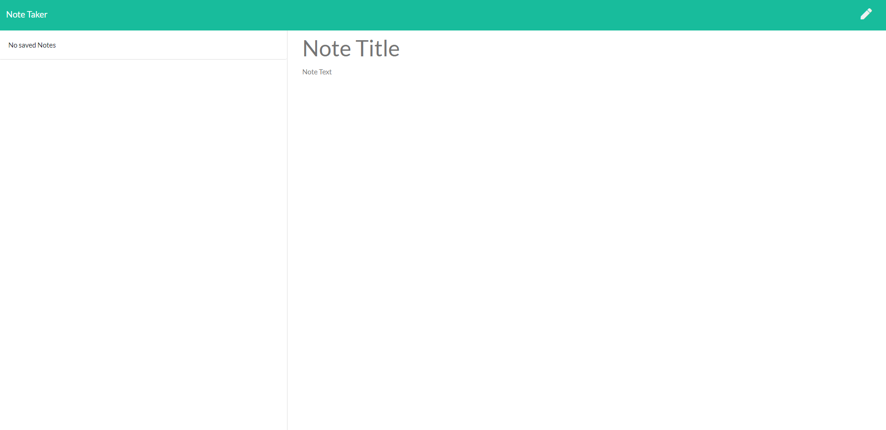
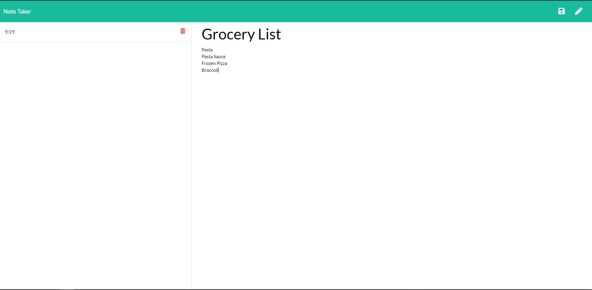

# The-Noter

## Table of Contents 
1. [Description](#Description)
2. [Requirements](#Requirements)
3. [Installation](#Installation)
4. [Getting Started](#GettingStarted)
5. [Contributing](#Contributing)
6. [Licensing](#Licensing)
7. [Further Reading](#FurtherReading)
8. [Author](#Author)

## Description 
Keeping track of everything in the day from thoughts to tasks can be difficult. Having an app to help would make organization way easier! With the Noter, you are able to write and save notes as well as delete previous notes.

## Installation
For the latest stable version of Express: 
`npm install express`

## Getting Started 
To experience Noter and its functionality, check it out on [Heroku](). 

## Contributing 
All Contributions are welcome. 

## Licensing 
The Noter is released under the ISC License.

## Further Reading
To learn more about ExpressJS, check out there documentation [here](https://expressjs.com/). If reading isn't your cup of tea, check out Traversy Media's youtube video, [ExpressJS Crash Course](https://www.youtube.com/watch?v=L72fhGm1tfE).

## Author 
This project was originally created by Kelsey Hughes. Check out their profile [here](https://github.com/kelbri10). 